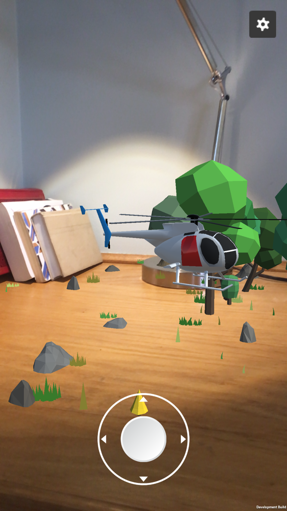

# AttackHelicopter_AR
testing the cool things you can do with AR with a basic helicopter game
***
## Screenshots
#### Cool Screenshots from Remote Control Mode
             

***
## Settings Page and IAP prompt UI
   

***
## GIFs
***
### Attached Control Scheme Demo

***
### Remote Control Scheme Demo

***
#### Old GIF from Version 1 of the Project

